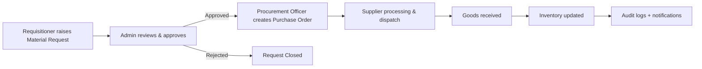
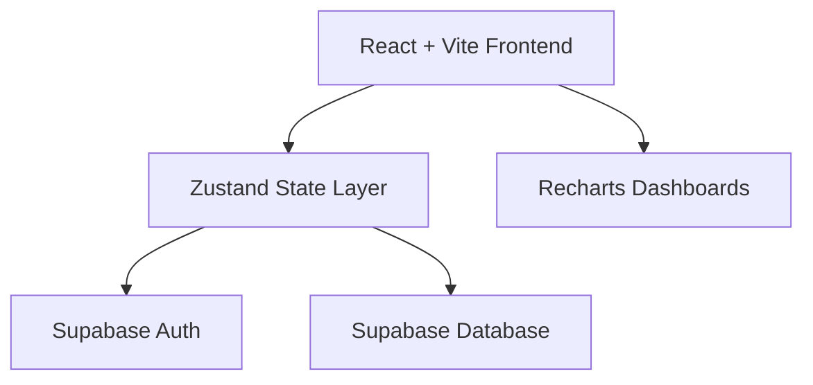

# ProcureX  
### Enterprise Procurement & Logistics Workspace

[](https://react.dev/)
[](https://www.typescriptlang.org/)
[](https://vitejs.dev/)
[](https://supabase.com/)
[](https://tailwindcss.com/)

ProcureX brings **request creation, approvals, purchase orders, inventory visibility, supplier management, dispatch tracking, and auditability** into one role-aware workspace.

---

## ✨ Why ProcureX

- 🎯 **Role-based operating model** for Admin, Requisitioner, and Procurement Officer
- 🔁 **End-to-end flow** from request to delivery
- 📊 **Live dashboards and analytics** for decisions with context
- 🔐 **Audit-ready operations** with traceable actions and status transitions

---

## 📈 Workflow Infographic



---

## 🧩 System Snapshot



---

## 👥 Role Matrix

| Role | Core Responsibility | Key Modules |
|---|---|---|
| **ADMIN** | Oversight, approvals, governance, user control | Dashboard, Approvals, POs, Users, Reports, Audit, Tasks, Settings |
| **RECEIVER** (Requisitioner) | Raise and track requests | Dashboard, Requests, New Request, Tasks, Notifications |
| **PROCUREMENT** | Execute sourcing and order lifecycle | Dashboard, Approved Requests, Inventory, Purchase Requests, Purchase Orders, Suppliers, Dispatch |

---

## 🛠 Tech Stack

- **Frontend:** React 18 + TypeScript + Vite  
- **Styling/UI:** Tailwind CSS + custom component system  
- **State Management:** Zustand  
- **Charts:** Recharts  
- **Backend Services:** Supabase (Auth + Database)  

---

## 🚀 Quick Start

### 1) Clone and install

```bash
git clone <your-repo-url>
cd Techtonics
npm install
```

### 2) Configure environment

Create `.env` from `.env.example`:

```bash
cp .env.example .env
```

Set:

```env
VITE_SUPABASE_URL=your_supabase_project_url
VITE_SUPABASE_ANON_KEY=your_supabase_anon_key
```

### 3) Run locally

```bash
npm run dev
```

---

## 📦 Scripts

| Command | Purpose |
|---|---|
| `npm run dev` | Start local dev server |
| `npm run build` | Build production bundle |
| `npm run preview` | Preview production build |
| `npm run lint` | Run ESLint checks |
| `npm run typecheck` | Run TypeScript type checks |

---

## 🗂 Project Structure

```text
src/
├── components/
│   ├── shared/
│   └── ui/
├── pages/
│   ├── admin/
│   ├── auth/
│   ├── officer/
│   └── requisitioner/
├── lib/
├── store/
└── types/
supabase/
└── migrations/
```

---

## 🔒 Operational Highlights

- Session-aware authentication using Supabase
- Password change flow support (`mustChangePassword`)
- Centralized toast/error handling
- Workflow transparency through status-driven UI and activity trails

---

## 🤝 Contributing

1. Create a feature branch
2. Make focused changes
3. Run lint + typecheck
4. Open a pull request with a clear summary

---

## 📜 License

Add your preferred license (MIT/Apache-2.0/etc.) in `LICENSE` if not already present.
